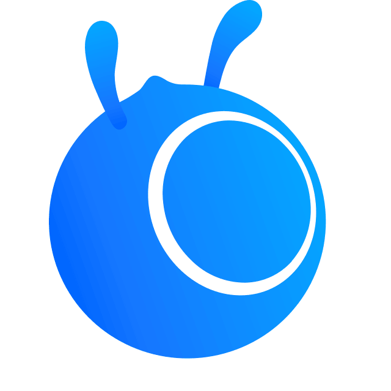

#  Hi, I'm Xin Jiang

  

  <b>🎓 Master of Computer Science @ UC Irvine</b> 
  🔥 AI Agents · LLM Applications · Software Engineering

  
  

---

<table align="center">
<tr>
<td valign="top" width="50%">

## Experience

- **AI Agent & LLM Engineering Intern** @  [Ant Group](https://www.antgroup.com/)   `Agent Evaluation` `Tracing` `Context Compression`
- **AI Engineer Intern** @ [Pazhou Lab](https://www.pazhoulab-huangpu.com/#/)   `Computer Vision` `Object Detection`
- **Research Assistant** @ [South China Normal University](https://www.scnu.edu.cn/)   `Single Mode Dynamic Hashing Method`

</td>
<td valign="top" width="50%">

## Projects

- **Multi-Agent AI Prototype Platform** 
  *(Industry-sponsored by [Cotality](https://www.cotality.com/))* 
[Try it ↗](https://protopilot.onrender.com/welcome) | [Demo video](https://drive.google.com/file/d/1YBcEzvtccvi5uLdjAVtt_jqFzcrAHjjQ/view?usp=sharing)   
  `Google ADK` `Litellm` `Multi-Agent Orchestration` `HITL`
  

- **Speech Emotion Recognition System**
  *([Live demo](https://speech-emotion-recognition-webapp.onrender.com))*   `LSTM` `Docker` `AWS`

</td>
</tr>
</table>

---

## 🧩 Tech Stack

<table width="100%" align="center" >
<tr>

<td align="center" valign="top">
  
### Agent Runtimes & Harnesses

 

&emsp;&emsp;

&emsp;&emsp;

 

Claude Code · Codex · DeepSeek Harness

</td>

<td align="center" valign="top">

### Agent Frameworks & Protocols

 

&emsp;&emsp;

&emsp;&emsp;

&emsp;&emsp;

 

Google ADK · OpenAI Agents SDK · LangGraph · MCP

</td>

<td align="center" valign="top" >

### Evaluation & Observability

 

&emsp;&emsp;

&emsp;&emsp;

 

Langfuse · DeepEval · OpenTelemetry

</td>

</tr>
</table>

 

  
  ### ⚙️ Engineering
  
  &emsp;&emsp;
  
  &emsp;&emsp;&nbsp;&nbsp;

---

